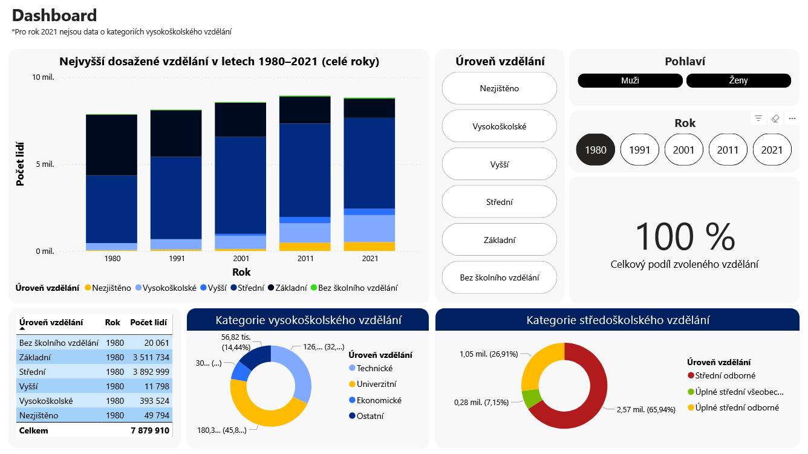

## Analysis of the highest educational attainment in the Czech Republic
This project deals with the analysis of data on the highest educational attainment of the population of the Czech Republic. The aim is to use Power BI to visualize the distribution of education across different categories and demographic groups. The project includes an interactive dashboard that allows users to filter the data by different levels of education, gender and other demographic factors.

## Key Features:
- Interactive visualization.
- Education Overview.
- Data model flexibility: The data is structured to allow for easy addition of other categories and filters, such as geographic region or age group.
- Custom visualizations: the project uses advanced visualizations, such as Chiclet Slicer and Donut Chart, to make interacting with the data more intuitive.
- Homepage: the project includes a clear introduction page that summarizes the project goal and provides context for all visualizations.
## Using
This project is ideal for government, researchers, or any organization that wants to better understand the educational structure of the Czech population. The visualizations make it easy to identify trends and demographic differences in educational attainment.
